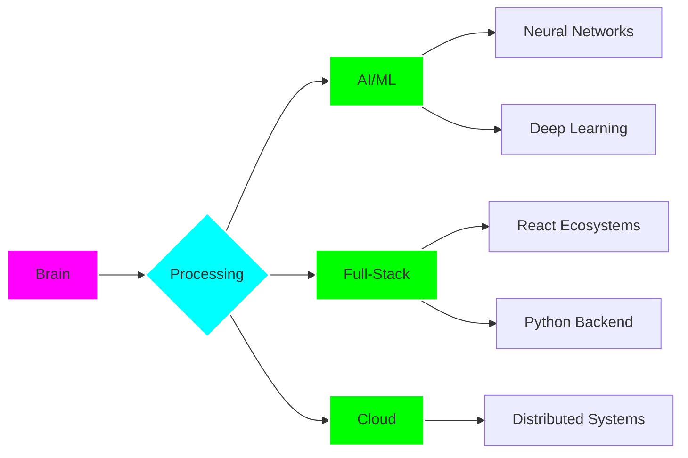

```ascii
╔════════════════════════════════════════════════════════════════════════════════════════
║                                                                                       ║
║   ██╗  ██╗ █████╗ ██╗   ██╗██╗     ██╗███╗   ██╗    ██╗  ██╗ █████╗ ██╗   ██╗██████╗  ║
║   ██║ ██╔╝██╔══██╗██║   ██║██║     ██║████╗  ██║    ██║ ██╔╝██╔══██╗██║   ██║██╔══██╗ ║
║   █████╔╝ ███████║██║   ██║██║     ██║██╔██╗ ██║    █████╔╝ ███████║██║   ██║██████╔╝ ║
║   ██╔═██╗ ██╔══██║╚██╗ ██╔╝██║     ██║██║╚██╗██║    ██╔═██╗ ██╔══██║██║   ██║██╔══██╗ ║
║   ██║  ██╗██║  ██║ ╚████╔╝ ███████╗██║██║ ╚████║    ██║  ██╗██║  ██║╚██████╔╝██║  ██║ ║
║   ╚═╝  ╚═╝╚═╝  ╚═╝  ╚═══╝  ╚══════╝╚═╝╚═╝  ╚═══╝    ╚═╝  ╚═╝╚═╝  ╚═╝ ╚═════╝ ╚═╝  ╚═╝ ║
║                                                                                       ║
║                        > ACCESS GRANTED: DEVELOPER PROFILE                            ║
║                        > INITIALIZING SYSTEM PROTOCOLS...                             ║
║                        > LOADING NEURAL PATHWAYS...                                   ║
║                                                                                       ║
╚════════════════════════════════════════════════════════════════════════════════════════
```

<div align="center">


## `> system.status()`

```bash
[SYSTEM ONLINE] Quantum state: Superposition of creativity & logic
[NEURAL NET] Training on: curiosity.dataset, innovation.model, empathy.weights
[STACK TRACE] Deep in: AI/ML | Cloud | Full-Stack | UI/UX Sorcery
```

<div align="center">


</div>

---

## `> cat /proc/expertise`

<div align="center">



</div>

### `> ls -la /skills/`

```
drwxr-xr-x  brain/neural        .
drwxr-xr-x  logic/systems       ..
-rwxr-xr-x  python.core         [████████████████████] 95%
-rwxr-xr-x  javascript.engine   [████████████████████] 92%
-rwxr-xr-x  ai_ml.algorithms    [█████████████████░░░] 88%
-rwxr-xr-x  react.components    [█████████████████░░░] 90%
-rwxr-xr-x  system.architecture [████████████████░░░░] 85%
-rwxr-xr-x  cloud.infrastructure[███████████████░░░░░] 82%
-rwxr-xr-x  ui_ux.design        [█████████████████░░░] 87%
-rwxr-xr-x  problem.solving     [████████████████████] 98%
```

<div align="center">

**PRIMARY STACK** → `Python` `JavaScript` `React` `Flask` `Django` `AI/ML` `Cloud`

**INTERFACE LAYER** → `TailwindCSS` `Bootstrap` `HTML5` `CSS3` `Responsive Design`

**DATA PERSISTENCE** → `MySQL` `SQLAlchemy` `Database Architecture`

**VERSION CONTROL** → `Git` `GitHub` `CI/CD Pipelines`

</div>

---

## `> ./projects --list --status=deployed`

<div align="center">

### 🔮 **CLASSIFIED OPERATIONS**

</div>

<table>
<tr>
<td width="50%">

#### `[PROJECT: SAFE_RETURN]` 🥈
**Classification:** AI-Powered Retrieval System  
**Tech Stack:** React • Django • ML Algorithms  
**Status:** `OPERATIONAL` | 2nd Place @ Glitch '24

```python
# Real-time image recognition
# Location-based matching algorithms
# Neural network for item classification
>>> Reuniting lost items with 87% accuracy
```

**Core Functions:**
- AI-powered visual matching
- Geospatial data processing
- Real-time notification pipeline

</td>
<td width="50%">

#### `[PROJECT: HAPPY_TRAILS]`
**Classification:** Travel Management System  
**Tech Stack:** Flask • SQLAlchemy • MySQL  
**Status:** `LIVE`

```javascript
// Backend architecture
const system = {
  authentication: 'JWT-based',
  database: 'Relational MySQL',
  api: 'RESTful design',
  admin: 'Dashboard analytics'
}
```

**Core Functions:**
- Real-time seat management
- Dynamic pricing algorithms
- Admin control panel

</td>
</tr>
<tr>
<td width="50%">

#### `[PROJECT: CARDIOSCOPE]`
**Classification:** Research & Development  
**Tech Stack:** Python • ML • QPSO Algorithm  
**Status:** `PUBLISHED`

```math
Optimization: Quantum Particle Swarm
Objective: Cardiovascular Disease Prediction
Accuracy Improvement: +15% over baseline
```

**Research Focus:**
- ML model optimization
- Healthcare AI applications
- Academic publication

</td>
<td width="50%">

#### `[PROJECT: KAVLIN_CONVEYS]`
**Classification:** Digital Expression Platform  
**Tech Stack:** HTML5 • CSS3 • JavaScript  
**Status:** `EVOLVING`

```css
.poetry {
  display: art;
  blend-mode: technology;
  emotion: infinite;
  design: immersive;
}
```

**Core Functions:**
- Interactive poetry display
- Aesthetic UI/UX design
- Responsive layouts

</td>
</tr>
</table>

---

## `> git log --contributions --global`

<div align="center">

### 🌐 **OPEN SOURCE FOOTPRINT**

```
commit a4f2c1b - GSSoC 2025: Top Contributor Status
commit 8e9d3f7 - Hacktoberfest: Global Top 10K
commit c5a1b9e - Multiple repositories enhanced
commit 7f3e2a8 - Community mentoring & code reviews
commit 2b4f8c3 - Documentation improvements across projects
```

<a href="https://holopin.io/@kavlinkaur">
  
</a>

</div>

---

## `> metrics.visualize()`

<div align="center">


</div>

---

## `> echo $PHILOSOPHY`

<div align="center">

```
┌─────────────────────────────────────────────────────────────┐
│                                                             │
│  "Every line of code is a verse in an epic poem,           │
│   Every algorithm a brushstroke on a digital canvas,       │
│   Every system a symphony waiting to be conducted."        │
│                                                             │
│  I don't just solve problems—I architect solutions          │
│  that think, breathe, and evolve.                          │
│                                                             │
│  Where others see errors, I see opportunities.              │
│  Where others stop, I iterate.                             │
│  Where others dream, I build.                              │
│                                                             │
└─────────────────────────────────────────────────────────────┘
```

</div>

---

## `> ./connect --protocol=human`

<div align="center">

```bash
# Establishing secure connection...
# Handshake protocol: Professional networking
# Encryption: Authenticity & mutual respect
```

[](https://www.linkedin.com/in/kavlin-kaur)
[](mailto:kavlinkaur2907@gmail.com)
[](https://github.com/Kavlin-Kaur)
[](https://instagram.com/k_kavlin)

</div>

---

## `> fortune | cowsay`

```
 _________________________________________
/ Currently debugging reality, one       \
| function at a time.                    |
|                                        |
| Status: Accepting collaboration        |
\ requests. Let's build something epic.  /
 -----------------------------------------
        \   ^__^
         \  (oo)\_______
            (__)\       )\/\
                ||----w |
                ||     ||
```

---

<div align="center">

```
╔════════════════════════════════════════════════════════════════════╗
║                                                                    ║
║  [SYSTEM MESSAGE]                                                  ║
║  Profile scan complete.                                            ║
║  Developer status: ACTIVE                                          ║
║  Availability: Open to innovative projects & collaboration         ║
║  Next deployment: TBD (building the future, one commit at a time) ║
║                                                                    ║
║  > Thank you for accessing this profile.                          ║
║  > Remember: The best code is yet to be written.                  ║
║                                                                    ║
╔════════════════════════════════════════════════════════════════════╗
```


**`> logout`**

</div>
